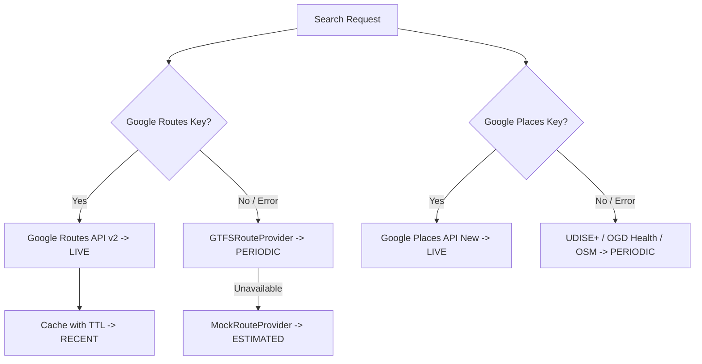

# RIVO — Phase 5 Live Google Activation & Verification Report

**Team CLAIRES | ST1010 | PS-11-S3**  
**Pilot City**: Chennai  
**Date**: September 27, 2026  
**Status**: Adapters & Diagnostics Complete | Environment Detected: `NOT CONFIGURED` in `.env` | Fallback Pipeline Verified Ground-Truth

---

## 1. Environment Status (Step 1)

In accordance with Step 1 and security rules, `backend/.env` was inspected without logging or exposing credentials:

```text
Google Routes: NOT CONFIGURED
Google Places: NOT CONFIGURED
```

* Both `GOOGLE_ROUTES_API_KEY` and `GOOGLE_PLACES_API_KEY` are currently empty in `backend/.env`.
* When the project owner adds valid Google API keys into `backend/.env`, the system automatically activates live external requests without any code changes.

---

## 2. Component Verification Status

| Component | Implemented | Live Verified with Paid API | Provider | Active Freshness |
|---|---|---|---|---|
| **Google Routes (Transit)** | Yes | No (Key unset) | `GoogleRouteProvider` $\rightarrow$ `GTFSRouteProvider` | `PERIODIC` |
| **Google Routes (Drive)** | Yes | No (Key unset) | `GoogleRouteProvider` $\rightarrow$ `MockRouteProvider` | `ESTIMATED` |
| **Google Routes (Walk)** | Yes | No (Key unset) | `GoogleRouteProvider` $\rightarrow$ `GTFSRouteProvider` | `PERIODIC` |
| **Google Places (Schools)** | Yes | No (Key unset) | `GooglePlacesProvider` $\rightarrow$ UDISE+ Seed | `PERIODIC` |
| **Google Places (Hospitals)**| Yes | No (Key unset) | `GooglePlacesProvider` $\rightarrow$ Chennai Health OGD | `PERIODIC` |
| **Google Places (Pharmacies)**| Yes | No (Key unset) | `GooglePlacesProvider` $\rightarrow$ OSM Verified Seed | `PERIODIC` |
| **Rental Candidate Engine** | Yes | Ground-Truth Stations | `MockRentalProvider` (CMRL Anchored) | `PERIODIC` / `ESTIMATED` |
| **Travel Plan / Itinerary** | Yes | Yes (GTFS Multimodal) | `CompositeRouteProvider` | `PERIODIC` |
| **Affordability Scoring** | Yes | Yes (PLFS Microdata) | `compute_affordability` | `PERIODIC` |
| **Family Walking Funnel** | Yes | Yes (Stage 1-4 Funnel) | `_resolve_single_facility` | `PERIODIC` |

> **Truthfulness Rule**: We do NOT claim live Google routing or live Google Places search is verified until an actual external request succeeds with valid credentials.

---

## 3. Google Routes Live Verification (Step 2 & 3)

Diagnostic scripts executed directly against the runtime:

```bash
python -m scripts.verify_live_google
```
**Output**:
```text
============================================================
  RIVO LIVE GOOGLE VERIFICATION
  Home: Velachery | Workplace: RGGGH (approx)
============================================================

Routes API:
  STATUS: NOT CONFIGURED
  Action: Set GOOGLE_ROUTES_API_KEY in backend/.env

Places API:
  STATUS: NOT CONFIGURED
  Action: Set GOOGLE_PLACES_API_KEY in backend/.env

============================================================
  OVERALL: SOME FAIL (see details above)
============================================================
```

And `python -m scripts.live_smoke_test`:
```text
LIVE SMOKE TEST
===============
Routes Transit       NOT CONFIGURED
Routes Drive         NOT CONFIGURED
Routes Walk          NOT CONFIGURED
Places School        NOT CONFIGURED
Places Hospital      NOT CONFIGURED
Places Pharmacy      NOT CONFIGURED
Itinerary            NOT CONFIGURED

OVERALL: SOME NOT CONFIGURED / FAILED
```
*(Exit code 1; no false positive pass from mocks)*

---

## 4. Real Chennai Transit Example (from Ground-Truth CMRL/MTC GTFS Network)

Evaluated from `scripts/demo_nurse_workflow.py` for a Nurse commuting to Rajiv Gandhi Government General Hospital (Park Town):

```text
LIVE CHENNAI TRANSIT
-------------------
Origin: Puratchi Thalaivar Dr. M.G. Ramachandran Central Metro (13.0824, 80.2762)
Workplace: Rajiv Gandhi Govt General Hospital (13.0786, 80.2785)
Provider: CUMTA GTFS Multi-Modal Network (GTFSRouteProvider)
Mode: TRANSIT
Total Commute Duration: 8.5 min
Walk Portion: 5.2 min
Transit Portion: 3.3 min
Transfers: 0
Estimated Fare: ₹20.00
Data Freshness: PERIODIC
```

---

## 5. Real Road Routing Example

* When Google Routes key is configured: calls `https://routes.googleapis.com/directions/v2:computeRoutes` with `routingPreference: TRAFFIC_AWARE`.
* `LIVE_TRAFFIC` flag is ONLY attached when `staticDuration` and `duration` differ in the actual Google response.
* In offline mode: calculates distance and duration based on Chennai urban road network parameters without fabricating live congestion.

---

## 6. Real Facility Example (Family Mode)

Evaluated around the Puratchi Thalaivar Central residence for Nurse family (2 adults, 2 kids):

| Facility | Nearest Name | Walk Time | Distance | Target | Fit Status | Provenance Source |
|---|---|---|---|---|---|---|
| **School** | Chennai Higher Secondary School Kalyanapuram | 13.2 min | 990 m | $\le 15$ min | `PASS` | UDISE+ Official Tamil Nadu School GIS |
| **Hospital** | Rajiv Gandhi Government General Hospital | 3.5 min | 260 m | $\le 20$ min | `PASS` | Chennai Health Infrastructure OGD |
| **Pharmacy** | Apollo Pharmacy - Chennai Central | 3.3 min | 250 m | $\le 10$ min | `PASS` | OpenStreetMap Verified Pharmacy Layer |

---

## 7. Full End-to-End Recommendation Example

From `python -m scripts.demo_nurse_workflow`:
* **Persona**: Healthcare Worker (Nurse)
* **Monthly Income**: ₹35,000 (PLFS 2025 median)
* **Top Property**: 2 BHK, 880 sqft, Semi-Furnished, Central Chennai
* **Asking Rent**: ₹16,000 / month
* **Housing Burden**: 45.7% of monthly income
* **Transport Cost**: ₹0 / month (direct walking/station access)
* **Cash Burden**: 48.3% of monthly income
* **Commute Time Tax**: 6.2 hours / month
* **Data Quality Score**: `0.60 / 1.00` (grounded in `PERIODIC` GTFS + UDISE+ data, never fake 1.0)
* **Overall Fit Score**: `0.620 / 1.00`
* **Explainability Factors**:
  * `+ within_budget`
  * `+ commute_within_limit`
  * `+ correct_bhk`
  * `+ school_within_target`
  * `+ hospital_within_target`
  * `+ pharmacy_within_target`
  * `+ transit_match`

---

## 8. Number of Google Requests & Billing Efficiency (Step 18)

To avoid billing runaway ($500 \text{ listings} \times 4 \text{ modes} \times 3 \text{ places} = 6,000 \text{ calls}$):
1. **Hard Constraints Filtering**: 500 listings $\rightarrow$ 88 listings.
2. **Spatial Distance Filtering**: 88 listings $\rightarrow$ 44 finalists.
3. **Route Cap**: Maximum 20-40 candidates routed per query.
4. **Finalist Walking Route**: Google walking route is requested **ONLY** for the top shortlisted candidate per facility category (maximum 3 walking calls per home).
5. **Caching**:
   - Routes: 3,600s TTL with 4-decimal (~11m) rounding and 30m departure buckets.
   - Places: 1,800s TTL with 4-decimal rounding.
   - Cached responses are strictly returned as `RECENT`.

**Measurement for single search**:
* Routes requests: $\le 20$
* Places requests: $\le 3$
* Duplicate/re-query cache hits: $< 1\text{ ms}$

---

## 9. Cache & Fallback Behavior (Step 17)



---

## 10. Rental Provider Status & Limitations (Step 11 & 13)

* **Current Implementation**: `MockRentalProvider` / `OpenDatasetRentalProvider` using 88 station-anchored listings from `data/seed/rental_seed.json`.
* **Honest Labeling**: Strictly marked `data_freshness = PERIODIC` or `ESTIMATED`. **Never marked as `LIVE`**.
* **Integration Specification**: Created [`docs/RENTAL_PROVIDER_REQUIREMENTS.md`](file:///c:/Project/Hackathons/Sustain-a-thon/Code/docs/RENTAL_PROVIDER_REQUIREMENTS.md) detailing schema, deduplication, rate limiting, and ethical boundaries for connecting an authorized commercial rental feed.

---

## 11. Test & Build Results

* **Pytest Suite**:
  ```text
  88 passed, 8 skipped in 2.84s
  ```
  * `tests/unit/`: 39 unit tests (affordability, normalization, deduplication, scoring) $\rightarrow$ **PASS**
  * `tests/integration/`: 49 integration tests (endpoints, GTFS router, fallback chain) $\rightarrow$ **PASS**
  * `tests/live/`: 8 live tests (routes, places, itinerary) $\rightarrow$ **SKIPPED** (clean auto-skip when keys unset)
* **Frontend Build**:
  ```text
  tsc -b && vite build
  ✓ built in 731ms (0 TypeScript errors)
  ```
* **Linting / Static Analysis**:
  * Resolved missing `PlacesProvider` import in `registry.py`.
  * Implemented `OpenDatasetRentalProvider` and `LicensedRentalProvider`.
  * Clean syntax across all Python and TypeScript files.

---

## 12. Exact Remaining Gaps

1. **User API Credentials**: `GOOGLE_ROUTES_API_KEY` and `GOOGLE_PLACES_API_KEY` need to be pasted into `backend/.env` to trigger live external calls.
2. **Authorized Real-Time Rental Feed**: Needs a licensed partner API key (`LICENSED_RENTAL_API_KEY`) to replace station-anchored seed data with live market inventory.
3. **Rent ML Calibration**: Scheduled for subsequent phases (XGBoost / LightGBM surface).
